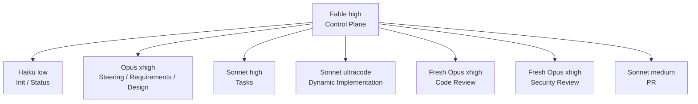

# ecc-vsdd Workflow Guide

## 1. 目的

ecc-vsddは、仕様を唯一の真実の源として、SteeringからPRまでを10フェーズで実行するClaude Codeプラグインです。

完了条件は、単にテストが通ることではありません。次の連鎖がすべて成立し、独立レビューを通過した状態を完了とします。

```text
REQ → Design → TASK → Test → Commit → Review → PR
```

技術スタック固有の知識は`.vsdd/specs/_steering/tech.md`へ集約します。各Skillはそこから設計観点、規約、検証コマンドを読み取るため、フロントエンド、API、CLIなどに共通適用できます。

## 2. 10フェーズ

| Phase | 名前 | 成果物 | Gate |
| --- | --- | --- | --- |
| 0 | Steering | `_steering/{tech,structure,context,open-questions}.md` | 保存hashが一致し、Open/DRAFTなし（stack・規約変更時は明示refresh） |
| 1 | Init | spec skeleton、source、`progress.md`、`run-state.json` | 入力と統合worktreeが有効 |
| 2 | Requirements | `requirements.md` | EARS形式の`REQ-NNN`と受入条件 |
| 3 | Requirements Review | `review-results/requirement-review.md` | 新規Opusの`verdict: PASS` |
| 4 | Design | `design.md` | 全REQとSteering viewpointsを設計へ反映 |
| 5 | Tasks | `tasks.md`、`progress.md` | 全TASKがREQとDesignへ追跡可能、両ファイルのTASK集合が完全一致 |
| 6 | Plan Review | `review-results/plan-review.md` | A〜Iすべて成功、新規Opusの`PASS` |
| 7a | Implementation Plan | `implementation-workflow.md` | コード変更前にDynamic Workflow計画を永続化 |
| 7b | Workflow Review | `review-results/implementation-workflow-review.md` | 新規Opusの`PASS` |
| 7c | Implementation | コード、テスト、TASK commit、`implementation-ledger.md` | TDD、retry、検証、全TASK→既存commit対応が成功 |
| 8 | Code + Security Review | `review-results/{code-review,security-review}.md` | 別々の新規Opusがともに`PASS` |
| 9 | PR | GitHub PR、`pr-result.json` | 全gateと構造化PR証跡が現在のhead commitに対して有効 |

Phase 6はRequirements、Design、Tasksの全体をまとめて検証します。Phase 7の内部にImplementation Workflow Reviewを置き、実装方法もコード変更前に独立審査します。

## 3. 制御と作業の分離

Fableは制御専用です。成果物、コード、テスト、レビュー、コミット、PR本文を作成しません。



| 責務 | Agent | Model | Effort |
| --- | --- | --- | --- |
| Orchestration | `vsdd-orchestrator` | Fable | `high` |
| Steering | `vsdd-steering-worker` | Opus | `xhigh` |
| Init / lifecycle | `vsdd-init-worker` | Haiku | `low` |
| Requirements | `vsdd-requirements-worker` | Opus | `xhigh` |
| Requirements Review | `vsdd-requirements-reviewer` | Opus | `xhigh` |
| Design | `vsdd-design-worker` | Opus | `xhigh` |
| Tasks | `vsdd-tasks-worker` | Sonnet | `high` |
| Plan Review | `vsdd-plan-reviewer` | Opus | `xhigh` |
| Implementation | `vsdd-implementation-driver` | Sonnet | `ultracode` |
| Workflow Review | `vsdd-implementation-workflow-reviewer` | Opus | `xhigh` |
| Code / Security Review | それぞれ専用reviewer | Opus | `xhigh` |
| 通常review修正 | `vsdd-remediation-worker` | Sonnet | `high` |
| 複雑review修正 | `vsdd-implementation-driver` | Sonnet | `ultracode` |
| PR | `vsdd-pr-worker` | Sonnet | `medium` |
| Status | `vsdd-status-worker` | Haiku | `low` |

`inherit`、fallback model、`max`、workerとしてのFableは禁止します。必要なモデル、effort、Dynamic Workflowが利用できない場合は`VSDD RUN BLOCKED`です。

## 4. Dynamic Workflow実装

Phase 7ではTASKを1件ずつFableからsubagentへ渡しません。独立したSonnetセッションが`tasks.md`全体を読み、Claude Code Dynamic Workflowを作成して実行します。

計画stageでは次を`implementation-workflow.md`へ保存します。

- 推論したTASK dependency DAG
- 並列グループ
- TASK worktreeとbranch割当
- TASKごとの検証コマンド
- Red → Green → Refactorのcheckpoint
- commitとintegration順序
- stop条件とretry方針

新規Opusがこの計画をレビューし、`PASS`した場合だけ同じSonnetセッションを再開して実装します。launcher自身がruntime preflight、phase状態、保存済みsession IDを検査します。長時間処理はlauncher-owned detached supervisorが保持し、Fableはshell backgroundを使わず45秒ごとのforeground `wait`をterminal結果まで反復します。同じstageの生存中supervisorは自動再利用され、二重起動されません。承認後の`implementation-workflow.md`はimmutableです。実際のattempt、Red/Green/Refactor証跡、検証結果、`TASK-to-SHA Mapping`は`implementation-ledger.md`へ分離します。Dynamic Workflowは最大16 agentの並列実行と再開機構を持ちますが、ecc-vsddは内部agentも`CLAUDE_CODE_SUBAGENT_MODEL=sonnet`で固定します。`ultracode`の起動条件は[Claude Code Dynamic Workflows](https://code.claude.com/docs/ja/workflows#have-claude-write-a-workflow)を参照してください。

各TASKは最大3attemptです。runtimeの`begin-attempt`/`finish-attempt`がTASK別に開始とPASS/FAILを永続化し、未完了attemptの重複開始と4回目を拒否します。3回目のFAILでrunは即座にblockedとなり、そのdependent TASKは開始しません。独立TASKは続行できますが、承認済みscopeにblocked TASKが残る限りPRへは進めません。

## 5. 独立レビューと重大度

すべてのreviewは作成workerとは別の新規Opus `xhigh`です。会話コンテキストを渡さず、ディスク上の成果物、対象commit、attempt番号だけを入力します。

review artifactは固定frontmatterを持ちます。

```yaml
---
review_type: requirements|plan|implementation-workflow|code|security
target_commit: <sha-or-N/A>
verdict: PASS|REVISE|BLOCKED
critical: 0
high: 0
medium: 0
low: 0
remediation_mode: none|standard|workflow
reviewer_model: opus
reviewer_effort: xhigh
review_attempt: 1
---
```

- CRITICAL/HIGH: 次フェーズとPRをblock
- MEDIUM: PRへ明示して続行可能
- LOW: 任意対応
- `BLOCKED`: 証拠不足、モデル／ツール失敗などによりreview自体が成立しない

Fableは`verdict`など固定fieldだけを読み、本文を再解釈したりseverityを変更したりしません。

## 6. 修正loop

Requirements、Plan、Implementation Workflowは、初回reviewと最大2回の修正・再review、合計3reviewまでです。上限到達後はblockします。

実装後はCode ReviewとSecurity Reviewを別々のOpusで同じcommitに対して実行します。block findingがある場合は次の適応routingを使います。

1. 通常: 新規Sonnet `high`で修正
2. reviewerが`remediation_mode: workflow`を指定: Sonnet `ultracode`
3. 通常修正後もblock findingが残る: 次回はSonnet `ultracode`
4. 初回review + 最大2修正でもCRITICAL/HIGHが残る: block

修正後は毎回、新しいCode OpusとSecurity Opusが再reviewします。

## 7. Gitとworktree

`start`は現在のcheckoutがcleanであることを要求します。`origin/HEAD`、明確なconventional branch、または明示`--base`から実際のbaseを検出し、`base_ref`、`base_branch`、`base_sha`を永続化します。曖昧な場合は`main`と仮定せずblockします。現在のbranchや作業treeを変更せず、`vsdd/<slug>`統合branchと専用integration worktreeを作成します。

Phase 7のDynamic Workflowはintegration worktreeを基点として、必要なTASK worktreeを動的に決めます。

- 成功時: 統合済みTASK worktreeを削除
- PR作成後: integration worktreeを確認用に保持
- BLOCKED時: 再開用に全状態を保持
- `cancel`: 実行停止のみ。未統合変更を削除しない
- `cleanup`: 安全確認後に明示削除

各実装commitは1つの`TASK-NNN`を記載します。複数TASKの実装を1commitへ混在させません。integration commitだけ複数TASK参照を許可します。

## 8. 再開と無効化

`.vsdd/specs/<slug>/run-state.json`へ次を保存します。

- agent、model、effort
- sourceを含むprimary artifactのSHA-256 input/output hash
- base ref、base branch、base SHA
- target commit
- attempt count
- review verdict
- integration/TASK worktree
- implementation session ID
- blocker evidence

`resume`および各phase前では同梱runtimeがhashとcommitを再計算します。Requirements、Design、Tasksなどの上流入力が変わっていた場合は影響を受ける最初のphaseと下流を原子的に無効化し、古いreviewを再利用しません。

`resume <slug> [source]`でソースを後から追加・差し替えられます。Initはspec skeletonを再作成せず、取得に成功したソースを保存してRequirements以降を無効化します。指定URLの取得失敗は黙って無視せずblockします。

## 9. 無人実行の判断境界

orchestratorは全workerへ`execution_mode: unattended`のcontext envelopeを渡します。このモードではRequirementsの7項目を含むphase内の質問、確認、approval、overwrite promptを待たず、永続化済みソースから回答を導出します。可逆な技術的仮定はartifactへ`assumed`として記録して続行できます。次は自動推測せずblockします。

- 製品の振る舞い
- データ損失の可能性
- セキュリティ境界
- 後方互換性
- 破壊的操作
- 外部システム／権限の追加承認

また、各下流phase前に`open-questions.md`の未解決Open、Steeringの`DRAFT`、Requirementsの`Glossary pending`を再検査します。Requirements生成中に新しいQ-IDが生じた場合もDesignへ抜けません。

## 10. PR gate

CRITICAL/HIGHが残る場合、PRは作成しません。すべてのblocking reviewがPASSした後、MEDIUMまたはmanual follow-upがあればDraft PR、なければready PRを作成します。

現在のexact `start|resume ... --until pr`プロンプトだけがpushとPR作成の権限を与えます。session/cwd/promptへ束縛され、次のユーザープロンプトで消えます。モデルや検証gateのwaiverにはなりません。guardが観測できる直接commandと一般的なshell/interpreter wrapperのpush/GitHub変更を拒否し、実際のPR workerへ結び付けたcapabilityを持つ専用brokerだけを対応publication経路とします。brokerがURL/number、base branch/SHA、head branch/SHA、target commitを`pr-result.json`へ保存し、runtime snapshotがcurrent `HEAD`との一致を検証して初めてPhase 9を完了します。
