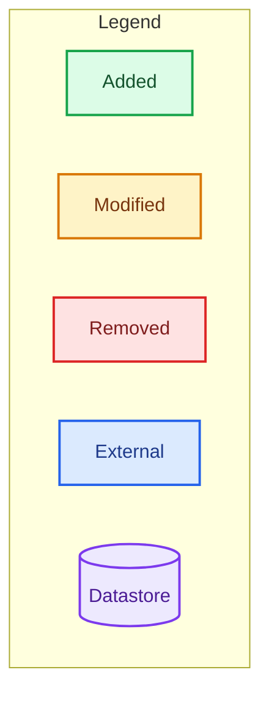
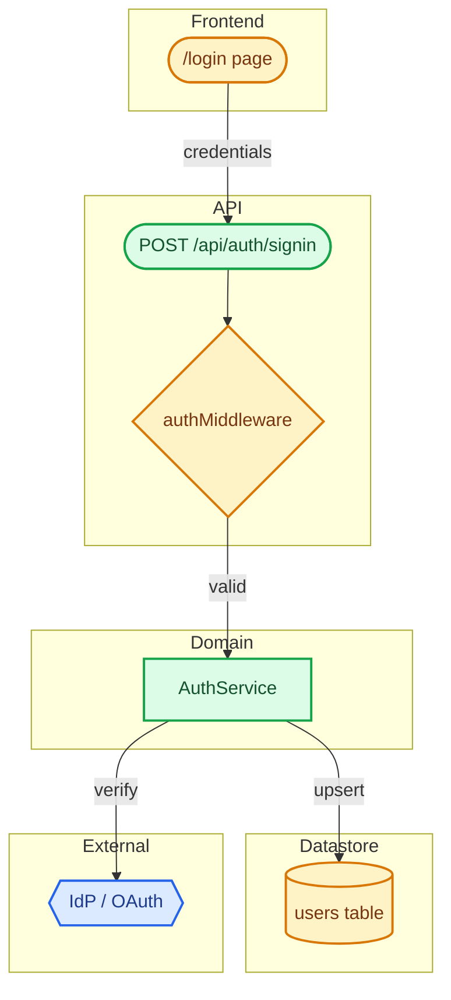

# Git PR: Pull Request Automation

Generate a PR description and open a draft pull request on GitHub. Adds a two-track scoring system (Review Attention + Simplicity) with Greptile-style confidence tags, and produces styled Mermaid diagrams reviewers can read at a glance.

All analysis runs through **CLI tools** (`git`, `gh`, `rg`, `ctx7`) — no MCP servers required.

## Usage

```bash
/git:pr [options]
```

## Options

| Option            | Description                                                | Example                   |
| ----------------- | ---------------------------------------------------------- | ------------------------- |
| (default)         | Generate PR description and create PR                      | `/git:pr`                 |
| `-p`              | Push current branch and create PR                          | `/git:pr -p`              |
| `-u`              | Update existing PR description only                        | `/git:pr -u`              |
| `--no-score`      | Skip both Review Attention and Simplicity scoring          | `/git:pr --no-score`      |
| `--no-simplicity` | Skip only the Cleanup Burden score (keep Review Attention) | `/git:pr --no-simplicity` |
| `--no-mermaid`    | Skip Mermaid diagram generation                            | `/git:pr --no-mermaid`    |

## Companion Skills

Do not try to do everything in `/git:pr`. Coordinate with two built-in skills:

| Skill            | Responsibility                                                   | Relation to `/git:pr`                                                                       |
| ---------------- | ---------------------------------------------------------------- | ------------------------------------------------------------------------------------------- |
| `/code-review`   | Review changed code for reuse, quality, efficiency, then **fix** | Run **before** `/git:pr` on big changes — lowers Simplicity / Complexity / Influence scores |
| `/git:pr` (this) | Generate description, Mermaid, scores → `gh pr create --draft`   | Touches **no code** — metadata only                                                         |
| `/review`        | Per-line review of an existing PR                                | Run **after** `/git:pr` on High / Critical PRs as a self-check before requesting reviewers  |

### Non-goals

- No per-line code review comments → that is `/review`'s job
- No code edits → that is `/code-review`'s job
- The Simplicity axis only **scores and points**; the actual fix is delegated to `/code-review`

## CLI Toolbox

Use plain CLI tools. Prefer the most specific tool for the job.

### Diff / change analysis (git + gh)

```bash
# Files changed in the current branch vs the base
git diff --name-status $(git merge-base HEAD origin/main)..HEAD

# Per-file +/- LOC
git diff --numstat $(git merge-base HEAD origin/main)..HEAD

# Commits on this branch
git log --oneline $(git merge-base HEAD origin/main)..HEAD

# Detect migration / auth / env-touching files
git diff --name-only $(git merge-base HEAD origin/main)..HEAD \
  | grep -E '(migration|migrate|auth|middleware|\.env|secrets)'
```

For `-u` (update), use `gh`:

```bash
gh pr view --json number,title,body,baseRefName,headRefName
gh pr edit --body-file pr-body.md
gh pr create --draft --title "<title>" --body-file pr-body.md
```

### Symbol / pattern / reference search (ripgrep)

```bash
# Find a symbol definition
rg -n --no-heading 'function\s+hashToken\b|const\s+hashToken\b|hashToken\s*=' .

# Find all references to a symbol (proxy for "find referencing symbols")
rg -n --no-heading '\bhashToken\b' .

# Count call sites
rg -c '\bhashToken\b' . | awk -F: '{sum+=$2} END {print sum}'

# Detect duplicate blocks: list candidates by signature
rg -n --no-heading 'function parseJWT|const parseJWT|parseJWT\s*=' .

# Common code-smell patterns
rg -n 'for\s*\(.*\)\s*\{[^}]*await' .          # await-in-loop
rg -n '\.map\([^)]*\)\.filter\(' .             # map().filter() chain
rg -n 'new\s+[A-Z][A-Za-z0-9_]*\(' .           # direct `new` (DI smell)
```

### Documentation lookup (ctx7 CLI — see `/find-docs` skill)

```bash
# Step 1: resolve library id
ctx7 library nextjs "How to set up app router with middleware"

# Step 2: query docs with the resolved id
ctx7 docs /vercel/next.js "How to add authentication middleware to app router"
```

Do not invoke more than 3 `ctx7` calls per PR generation. See the `/find-docs` skill for full rules, version pinning, and authentication.

## Workflow

> Companion chain: `/code-review` (pre) → `/git:pr` (this) → `/review` (post). For large changes, run `/code-review` first so scores drop and reviewers have less to wade through.

### Default (no option)

1. **Analyze diff** with `git diff --name-status` + `git diff --numstat` + `git log --oneline` (base = `origin/main` or repo default branch)
2. **Read template** from `.github/pull_request_template.md`
3. **Compute Review Attention Score (Total)** — weighted average of Risk / Influence / Complexity
   - Tag every contributing factor with **Confidence (✅ / 🤔 / ❓)**
   - Apply confidence dampening: 🤔 = ×0.7, ❓ = ×0.4
4. **Compute Cleanup Burden (separate)** — use `rg` to detect duplicates, dead code, NIH, inefficient patterns
   - Same Confidence dampening
   - **Not** added to Total — it is an independent score
5. **Build PR description** (follow template, write in the team's language)
   - Insert **two badges** (Review Attention + Cleanup Burden) right above the overview section
   - Append two trailing sections: **`## 📊 Review Attention Score`** and **`## 🧹 Cleanup Burden`**
   - Every contributing-factor row must carry a Confidence tag
   - End each scoring section with a Confidence summary (✅ N / 🤔 M / ❓ K)
   - Emit dynamic `/code-review` and `/review` suggestions based on thresholds
6. **Fetch references** via `ctx7` (resolve library → query docs); max 3 calls
7. **Generate Mermaid diagram** — `classDef` palette + legend subgraph + shape semantics are mandatory
8. **Create PR**: `gh pr create --draft --title <title> --body-file <pr-body.md>`

### With `-p`

1. `git push -u origin "$(git rev-parse --abbrev-ref HEAD)"`
2. Continue with the default workflow

### With `-u`

1. Re-run steps 1, 3, 4, 7 (diff analysis + score recompute + Mermaid regen)
2. `gh pr edit --body-file pr-body.md`

## Requirements

1. Follow the PR template structure exactly
2. **Write the entire PR body in Japanese** — title, overview, implementation details, testing steps, reviewer notes, score sections, Signal quality lists, and Mermaid node labels. No exceptions.
3. Include concrete implementation details
4. List concrete testing steps as a bulleted checklist
5. Use `ctx7` for documentation URLs (see `/find-docs` for usage rules)
6. Always include a Mermaid diagram (unless `--no-mermaid`)
7. Always emit the two-line badge block + two trailing scoring sections (unless `--no-score`)
8. Every contributing-factor row must carry a Confidence tag (✅ / 🤔 / ❓); end each section with `Signal quality: ✅ N confirmed · 🤔 M inferred · ❓ K speculative`
9. Mermaid blocks must always include a `classDef` block and a Legend subgraph

## Scoring System

### A. Review Attention Score (Total)

Weighted average of three axes (0–100). Tells reviewers how carefully to read.

| Axis                               | Weight | Evaluates                                                                                          |
| ---------------------------------- | ------ | -------------------------------------------------------------------------------------------------- |
| **Risk** (blast radius on failure) | 0.45   | DB migration, auth/authz, payment, breaking API change, prod config, `.env`/secrets, deletion      |
| **Influence** (spread)             | 0.35   | files changed, LOC, directories crossed, call sites, shared modules (`packages/`, `lib/`, `core/`) |
| **Complexity** (cognitive load)    | 0.20   | concurrency/async, new algorithms, commit granularity, unrelated changes mixed in                  |

#### Risk rubric

- DB schema change (migration file added/modified): **+30**
- Auth / authorization (`auth/`, `middleware/`, RLS, JWT): **+25**
- Existing public API signature change: **+20**
- `.env.example` / secrets-related: **+20**
- External API integration (new or modified): **+15**
- Includes deletion of files or records: **+15**

#### Influence rubric

- Files changed: 1–3 → +5 / 4–10 → +15 / 11–30 → +30 / 31+ → +45
- LOC (added + removed): <100 → +5 / 100–500 → +15 / 500–2000 → +30 / 2000+ → +45
- Touches shared modules (`shared/`, `lib/`, `core/`, `packages/*/`): **+20**
- Modifies a function with 10+ call sites (`rg -c '\bSYMBOL\b'`): **+15**

#### Complexity rubric

- New concurrency/async code (`Promise.all`, channels, goroutines, async chains): **+20**
- New algorithm or data structure: **+15**
- Unrelated changes mixed in (e.g. feature + big lint cleanup): **+15**
- Noisy commits (WIP, unsquashed): **+10**

### B. Cleanup Burden (separate axis)

`/code-review` perspective — how much polish remains before merge. Independent 0–100 score; **never folded into Total**.

> **Reading the score**: 0 = nothing to clean up (great), 100 = major cleanup recommended. A score of 10 means the code is clean, not that it failed.

| Lens       | Looks at                                                 |
| ---------- | -------------------------------------------------------- |
| Reuse      | Existing utilities ignored (NIH), reinvented helpers     |
| Quality    | Duplicated blocks, dead code, naming drift, magic values |
| Efficiency | N+1, await-in-loop, redundant `.map().filter()` chains   |
| Design     | Over-abstraction, tight coupling, hard-to-test code      |

#### Simplicity rubric

- Reinvented existing utility/helper (`rg` finds same name or near-identical signature elsewhere): **+20**
- Duplicate block (same/near-identical code in 3+ places): **+15**
- Inefficient pattern (await-in-loop / N+1 / redundant map+filter): **+20**
- Newly introduced unused import / dead code: **+10**
- Magic number / hardcoded value (not extracted to a constant): **+10**
- Naming or directory layout drifts from existing conventions: **+10**
- Over-abstraction (unused generic params, premature interface): **+15**
- Tight coupling preventing tests (direct `new`, no DI): **+10**

> Compute Simplicity **mechanically with `rg`** wherever possible (duplicate symbols, dead imports, await-in-loop). Do not score on impression alone.

### C. Confidence labels (Greptile-style) — required on every factor

Every contributing-factor row in the score tables must carry a Confidence tag, so reviewers can separate signal from noise at a glance.

| Tag                | Basis                                                               | Multiplier | Example                                                 |
| ------------------ | ------------------------------------------------------------------- | ---------- | ------------------------------------------------------- |
| ✅ **Confirmed**   | Mechanically verifiable (diff, file presence, `rg` exact match)     | **×1.0**   | "migration file `migrations/0042_*.sql` exists in diff" |
| 🤔 **Likely**      | Pattern match / naming convention / static-analysis level inference | **×0.7**   | "`for...await` pattern → probably an N+1"               |
| ❓ **Speculative** | LLM judgment only; depends on runtime/design intent                 | **×0.4**   | "looks like premature abstraction"                      |

- **Output rule**: every factor row starts with its tag (`✅ DB migration added (+30)`)
- **Summary**: each scoring section ends with a `Signal quality` block that lists **each item by confidence tier**:

  ```
  Signal quality（シグナル品質）:
  - ✅ confirmed（確認済み）: migration ファイル追加, auth middleware 変更, lib/auth.ts 変更 (23 call sites)
  - 🤔 inferred（推定）: refactor が feature と混在 (commit 粒度から推測)
  - ❓ speculative（推測）: なし
  ```

  Rules:
  - Write each item as a short phrase (not a full sentence) so reviewers can skim
  - List items within each tier on one comma-separated line
  - If a tier has zero items, write `なし`
  - The tier labels always include the Japanese gloss: `confirmed（確認済み）`, `inferred（推定）`, `speculative（推測）`
  - This is a **list of factors** (not a score). "✅ confirmed: 9件" means 9 things were mechanically verified, not a 9/10 rating.

- **Warning**: if ❓ share exceeds 40%, append `⚠️ 推測ベースの要因が多め — スコアは参考値として扱ってください`

### Score → Level mapping (shared)

> **Direction**: For **both** scores, a **higher number = more work needed** — not a grade.
>
> - Review Attention 80 → reviewers must focus hard (risky PR)
> - Review Attention 10 → reviewers can skim (safe PR)
> - Simplicity 80 → lots of cleanup possible before merge
> - Simplicity 10 → code is already clean, nothing to do

| Score  | Review Attention     | Simplicity         | Badge |
| ------ | -------------------- | ------------------ | ----- |
| 0–34   | Low ↓ light focus    | Clean ↓ no cleanup | 🟢    |
| 35–64  | Medium               | Some cleanup       | 🟡    |
| 65–84  | High ↑ close reading | Needs cleanup      | 🔴    |
| 85–100 | Critical ↑ all hands | Heavy cleanup      | 🚨    |

### Suggestion logic (printed at the end of the scoring block)

| Condition                          | Output                                                                                             |
| ---------------------------------- | -------------------------------------------------------------------------------------------------- |
| Cleanup Burden ≥ 50                | `> 💡 Run /code-review (Cleanup Burden {score} = {level}): {top reasons} — easy wins before merge` |
| Total ≥ 65                         | `> 💡 Run /review (Review Attention {score} = {level}): self-review before assigning reviewers`    |
| Total < 35 AND Cleanup Burden < 30 | (suppress — already a clean, low-risk PR)                                                          |

### Placement

#### Top of the body — two-line badge block (right before the overview)

```
> 🔍 **Review Attention: 🔴 High** (78 risk pts · higher = needs more focus) — DB migration + auth middleware rewrite, 14 files touched
> 🧹 **Cleanup Burden: 🔴 High** (75 cleanup pts · higher = more to fix) — hashToken() reinvented + parseJWT duplicated 3x
```

**Rules for the badge line**:

- Always write `(N risk pts · higher = needs more focus)` for Review Attention so the direction is unambiguous.
- Always write `(N cleanup pts · higher = more to fix)` for Simplicity — never write it as "X/100" because low scores look like a failing grade when they are actually good (low = clean).
- A badge like `🟢 Low (8 cleanup pts · higher = more to fix)` correctly signals "almost nothing to clean up".

#### Bottom of the body — full example of both sections (right before the self-checklist)

```markdown
## 📊 Review Attention Score

**Total: 🔴 High** (78 risk pts — higher = reviewers need to focus more)  
Weighted average of Risk + Influence + Complexity. Does NOT include Simplicity.

| Axis       | Axis score | Contributing factors (Confidence)                                                                      |
| ---------- | ---------- | ------------------------------------------------------------------------------------------------------ |
| Risk       | 85 pts     | ✅ DB migration added (+30) / ✅ auth middleware rewrite (+25) / ✅ `.env.example` updated (+20)       |
| Influence  | 72 pts     | ✅ 14 files / 612 LOC / ✅ shared `lib/auth.ts` modified (23 call sites via `rg`)                      |
| Complexity | 68 pts     | ✅ new Promise.all concurrency / 🤔 refactor mixed into the feature (inferred from commit granularity) |

Signal quality（シグナル品質）:

- ✅ confirmed（確認済み）: DB migration ファイル追加, auth middleware 書き換え, `.env.example` 更新, 14 files / 612 LOC, shared `lib/auth.ts` 変更 (23 call sites)
- 🤔 inferred（推定）: refactor が feature と混在 (commit 粒度から推測)
- ❓ speculative（推測）: なし

### For reviewers

- Verify the rollback plan for `migrations/0042_*.sql`
- Confirm the `lib/auth.ts` signature change is matched by every one of the 23 call sites
- E2E: log in → refresh session → log out on a real environment

---

## 🧹 Cleanup Burden (separate, not in Total)

**🔴 High** (75 cleanup pts — higher = more to clean up)  
`/code-review` perspective. 0 = nothing to do, 100 = heavy cleanup recommended.

| Lens                  | Contribution | Where (Confidence)                                                                                      |
| --------------------- | ------------ | ------------------------------------------------------------------------------------------------------- |
| Reuse                 | +20          | ✅ reinvents existing `hashToken()` from `lib/utils/hash.ts` (`src/auth/token.ts:42`, `rg` exact match) |
| Quality (duplication) | +15          | ✅ `parseJWT` duplicated across `api/signin.ts`, `api/refresh.ts`, `middleware/auth.ts`                 |
| Efficiency            | +14 (×0.7)   | 🤔 `await` inside `for` loop at `services/user-sync.ts:18` — convert to `Promise.all`                   |
| Quality (magic value) | +10          | ✅ `86400` (= 1 day) hardcoded in 2 places                                                              |
| Quality (dead code)   | +10          | ✅ 2 unused imports                                                                                     |
| Design                | +6 (×0.4)    | ❓ generic type params on `AuthService` may be overkill                                                 |

Signal quality（シグナル品質）:

- ✅ confirmed（確認済み）: `hashToken()` 再発明 (rg 完全一致), `parseJWT` 3箇所重複, `86400` ハードコード 2箇所, 未使用 import 2件
- 🤔 inferred（推定）: `for` ループ内 `await` (N+1 パターンから推測)
- ❓ speculative（推測）: `AuthService` の generic 型パラメータが過剰かも
  (Speculative 比率 17% — 警告なし)

> 💡 Next actions
>
> - Run `/code-review` (Cleanup Burden 75 = High): the duplicates and reinvention above can be cleaned up before merge
> - Run `/review` (Review Attention 78 = High): self-review before assigning reviewers
```

## Mermaid Visualization Standard

Reviewers must be able to tell **what's new / modified / removed / external** from color and shape alone in under a second. Generate that every time.

### Color palette (works in both GitHub light and dark mode)

| Purpose             | classDef name | fill      | stroke    | color     |
| ------------------- | ------------- | --------- | --------- | --------- |
| Added               | `added`       | `#dcfce7` | `#16a34a` | `#14532d` |
| Modified            | `modified`    | `#fef3c7` | `#d97706` | `#78350f` |
| Removed             | `removed`     | `#fee2e2` | `#dc2626` | `#7f1d1d` |
| External dependency | `external`    | `#dbeafe` | `#2563eb` | `#1e3a8a` |
| Datastore           | `datastore`   | `#ede9fe` | `#7c3aed` | `#4c1d95` |
| Highlight           | `highlight`   | `#fce7f3` | `#db2777` | `#831843` |

Use `stroke-width:2px` to make borders pop. Text color stays dark so it stays readable in dark mode.

### Shape semantics

| Shape                     | Syntax            | Meaning               |
| ------------------------- | ----------------- | --------------------- |
| Rectangle `[...]`         | process / service | generic component     |
| Stadium `([...])`         | endpoint / entry  | API route, page       |
| Cylinder `[(...)]`        | datastore         | DB, cache, queue      |
| Rhombus `{...}`           | branch / guard    | guard, middleware     |
| Hexagon `{{...}}`         | external system   | 3rd-party API         |
| Double circle `(((...)))` | event             | webhook, cron trigger |

### subgraph layers

Group nodes into `Frontend` / `API` / `Domain` / `Datastore` / `External` subgraphs to minimize visual scanning.

### Required: include a Legend every time



### Full example (auth feature PR)



### Sequence diagrams

`sequenceDiagram` does not honor `classDef`. Append an emoji marker to each `participant` label — **🟢 (added) / 🟡 (modified) / 🔴 (removed) / 🔵 (external)** — and use `Note over X: 🟢 new` where extra emphasis helps.
