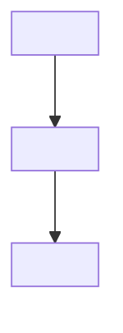

# Design: <!-- Feature Name -->

> **Spec slug**: <!-- slug -->
> **Status**: draft
> **Last updated**: <!-- YYYY-MM-DD -->

---

## 0. Auto-Design Summary _(auto mode only)_

<!-- In --mode auto, insert a plain-language paragraph here summarising every design
     decision for non-engineer review. Remove this section in --mode standard. -->

---

## 1. Overview

<!-- 2-4 sentences describing what this feature does, which user problem it solves,
     and the key technical approach. -->

### 1.1 Scope

**In-scope**:

- <!-- item -->

**Out-of-scope**:

- <!-- item -->

Satisfies: <!-- REQ-XXX -->

---

## 2. Architecture Diagram

<!-- Mermaid diagram of the modules this feature touches and the data flow between them.
     Use the module boundaries from _steering/structure.md and the technologies from
     _steering/tech.md §1 — do not introduce unlisted layers. -->



Satisfies: <!-- REQ-XXX -->

---

## 3. File Structure Plan

<!-- Concrete paths following the project layout recorded in _steering/structure.md.
     Mark every entry (create) or (modify). -->

Files to **create** (new):

```
<!-- path/to/new/file  — one-line responsibility note -->
```

Files to **modify** (existing):

```
<!-- path/to/existing/file  — what changes -->
```

Satisfies: <!-- cross-cutting concern, no direct REQ -->

---

<!-- ============================================================================
     DESIGN VIEWPOINT SECTIONS — instantiated by vsdd-design Step 3.
     Insert one "## <N>. <Viewpoint section name>" per row of _steering/tech.md §2
     Design Viewpoints, renumbering the sections below. Each viewpoint section must
     answer the question defined for it in tech.md §2 (see the viewpoint catalog),
     and must end with a Satisfies: line.

     Example (web-frontend project): ## 4. State Management / ## 5. Component Hierarchy
     Example (web-api project):      ## 4. Data Model & Migration / ## 5. API Contract
     ============================================================================ -->

## 4. <!-- Viewpoint section (one per tech.md §2 row) -->

<!-- Design decisions for this viewpoint: tables, sketches, or diagrams as appropriate.
     Sketch-level only — full implementation belongs to tasks. -->

Satisfies: <!-- REQ-XXX -->

---

## 5. Error Handling Strategy

<!-- Apply the error-handling policy from _steering/tech.md §3 Conventions to THIS feature:
     which failures can occur, where each is caught, and what the user/caller observes.
     The policy itself lives in tech.md — only its application is designed here. -->

| Scenario                         | Handling                                 |
| -------------------------------- | ---------------------------------------- |
| <!-- e.g. validation failure --> | <!-- per tech.md error policy -->        |
| <!-- e.g. dependency down -->    | <!-- degrade / retry / surface error --> |

Satisfies: <!-- cross-cutting concern, no direct REQ -->

---

## 6. Test Strategy

<!-- Apply the project's test policy (tech.md §3 Conventions) to this feature, and use
     the commands from tech.md §4 Verification Commands. For each file in the File
     Structure Plan, state the test type, priority, and what behavior is covered. -->

| File / Unit   | Test type                         | Priority | Coverage target              |
| ------------- | --------------------------------- | -------- | ---------------------------- |
| <!-- path --> | <!-- unit / integration / e2e --> | P1       | <!-- behavior, not lines --> |

Satisfies: <!-- REQ-XXX -->

---

## 7. Open Questions

<!-- List any unresolved decisions here. Remove before implementation starts. -->

- [ ] <!-- question -->

---

_Template: vsdd-design skill `templates/design.md`_
